#  VISOR D'ELEMENTS WINDOWS SERVER 

## Crear una vista personalitzada.
Primer obrirem el desplegable de Herraminetas de l'administrador de Windows server i clicarem a on fica "Visor de eventos".

A la dreta hi ha l'apartat "Acciones" i clicarem a "Crear vista personalizada".
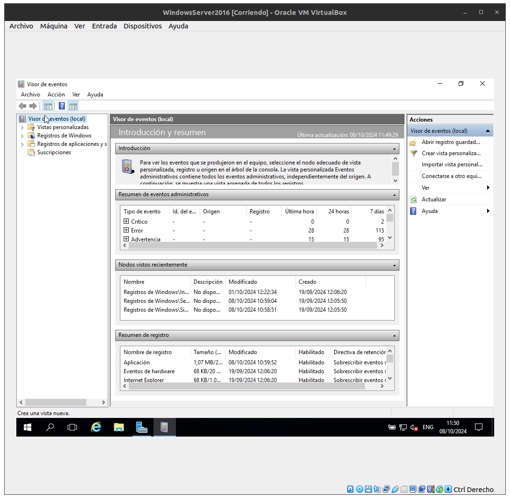
A la part de "Por registo" seleccionarem "Aplicación" així només sortirán els events de applicacions. Al apartat ID dicarem el ID de l'event que volem directament i li donem a "Aceptar".
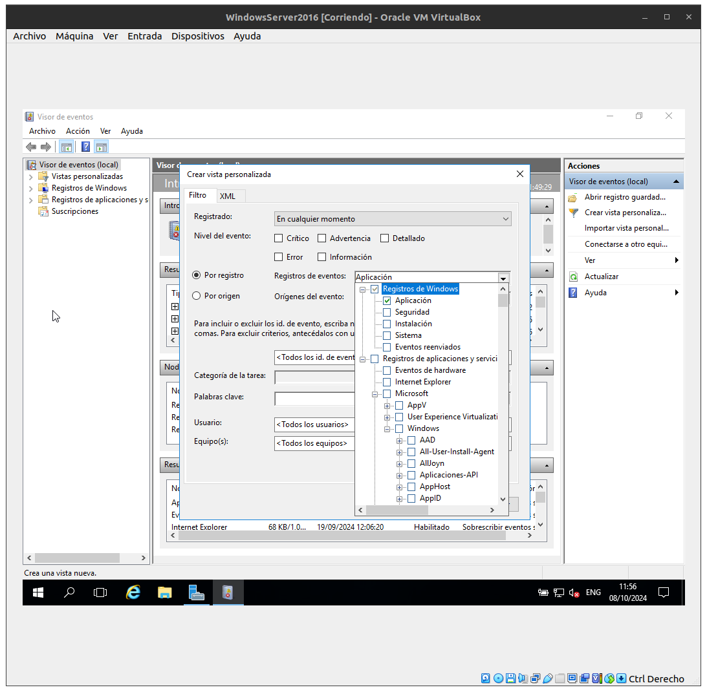
Ara en sortirá una finestra que li posarem el nom de la vista i una petita descripció.
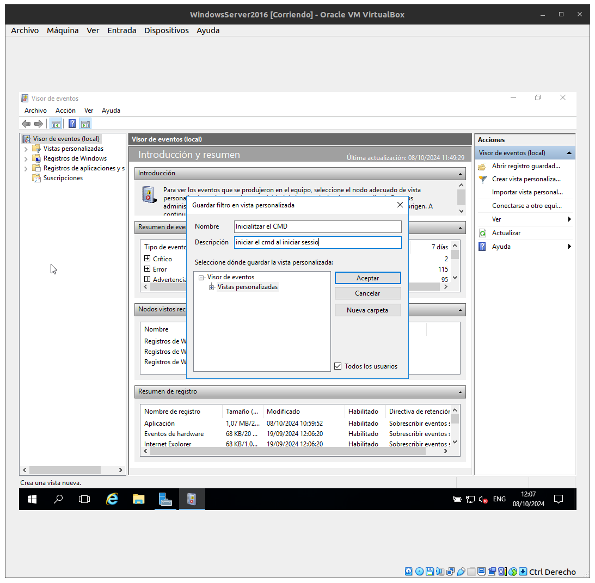

## Crea una tasca.
Després de guardar a la dreta li donarem a "Adjuntar tarea a esta vista".
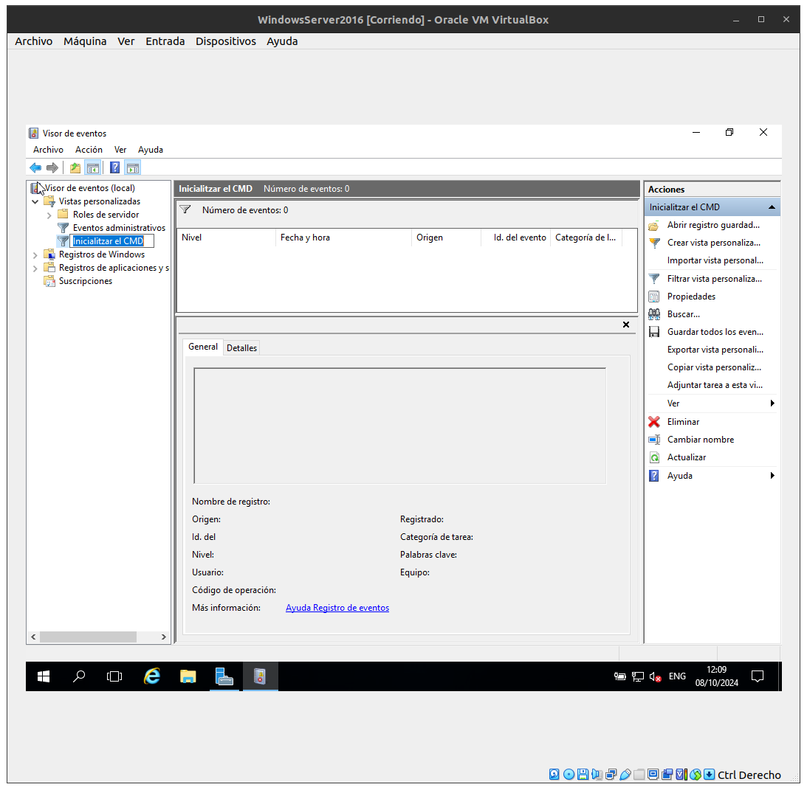
Ens sortirá una finestra i li donarem a Siguiente.
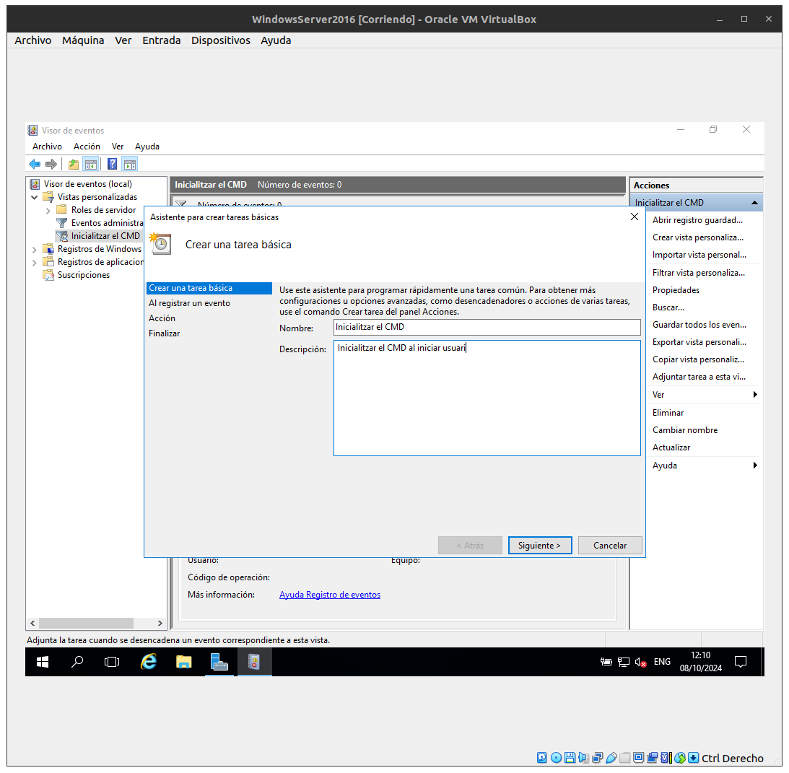
Siguiente.
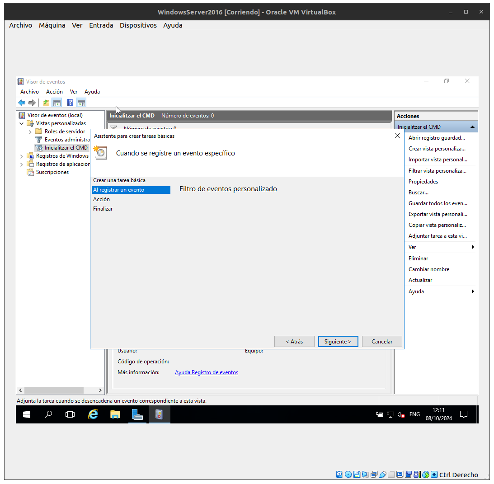
I li donarem a "Iniciar un programa". Li donarem a Siguiente.
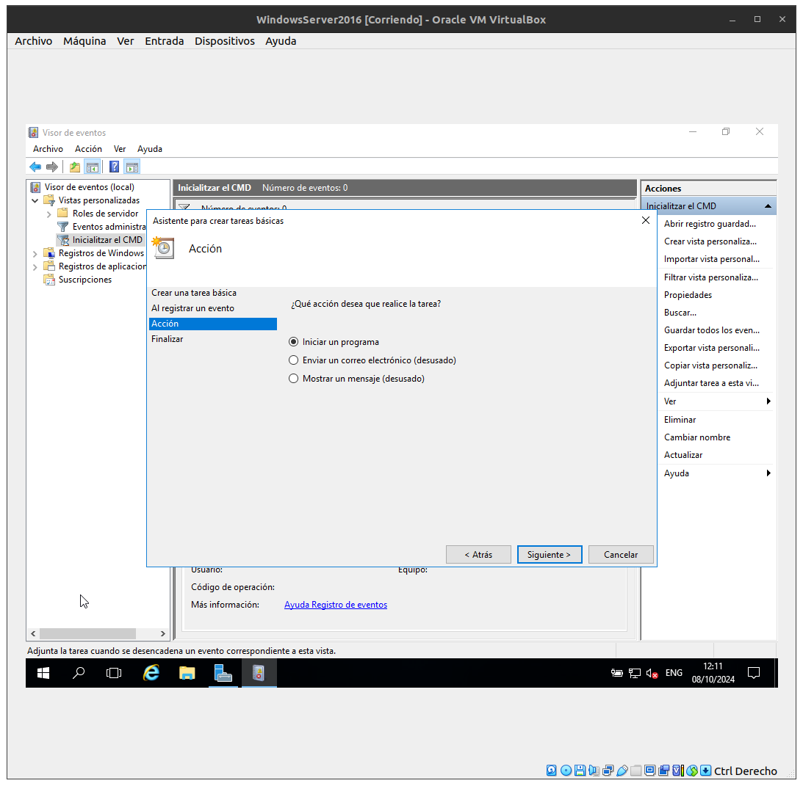
Ara escollirem el programa que volem iniciar, en aquest cas el CMD. I li donarem a Siguiente i Finalizar.
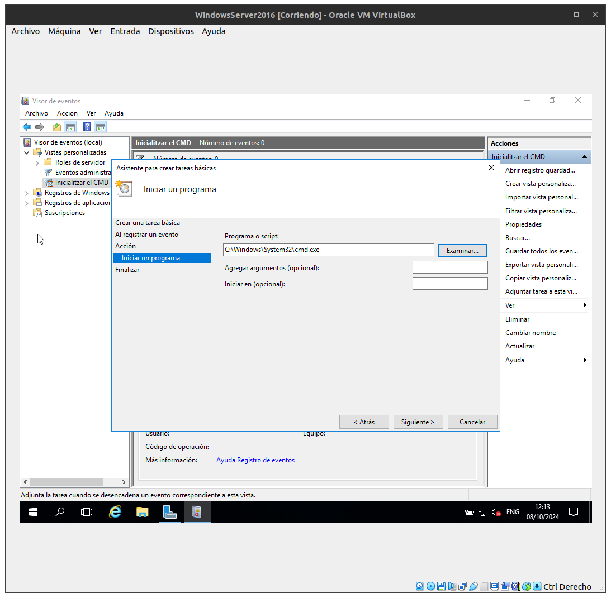

## Exportar vista a XML.
Ara per guardar una vista a XML haurem d'importarla. Per això a la part dreta hi ha un apartat que fica "Exportar vista personalizada".

Seleccionarem on volem guardar l'element XML i li donem a "Guardar". L'aurem de passar d'una màquina a una altra. La pots pujar a Drive i així la pots descarregar. 

## Importar XML desde una altra MV.
Una vegada tenim l'arxiu XML descarregat obrirem el "Visor de eventos" i li donarem a "Importar vista personalizada"
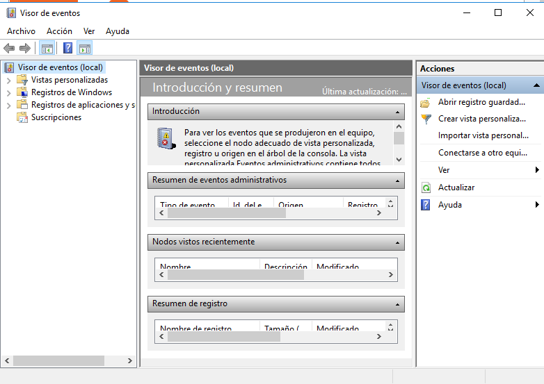
Busquem l'arxiu XML que hem descarregat i li donem a "Abrir"
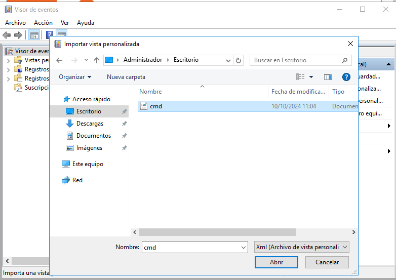
Ens sortirà una finestra amb l'informació de l'event i li donem a "Aceptar"
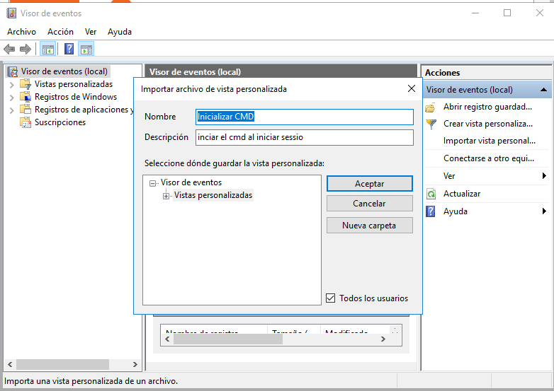
Ara ja tenim el visor d'events importat amb tota l'informació d'aquest. 

