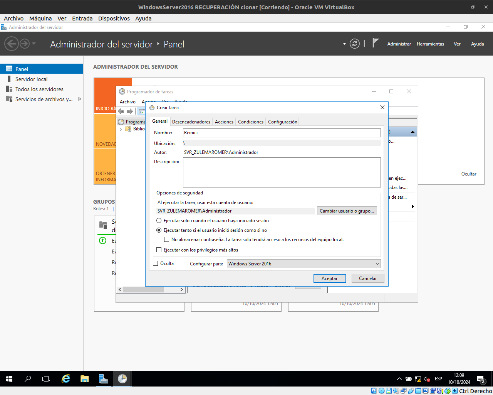
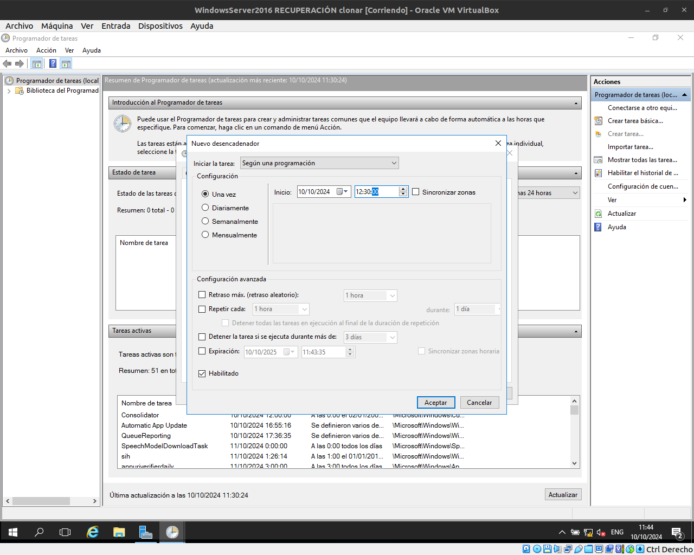
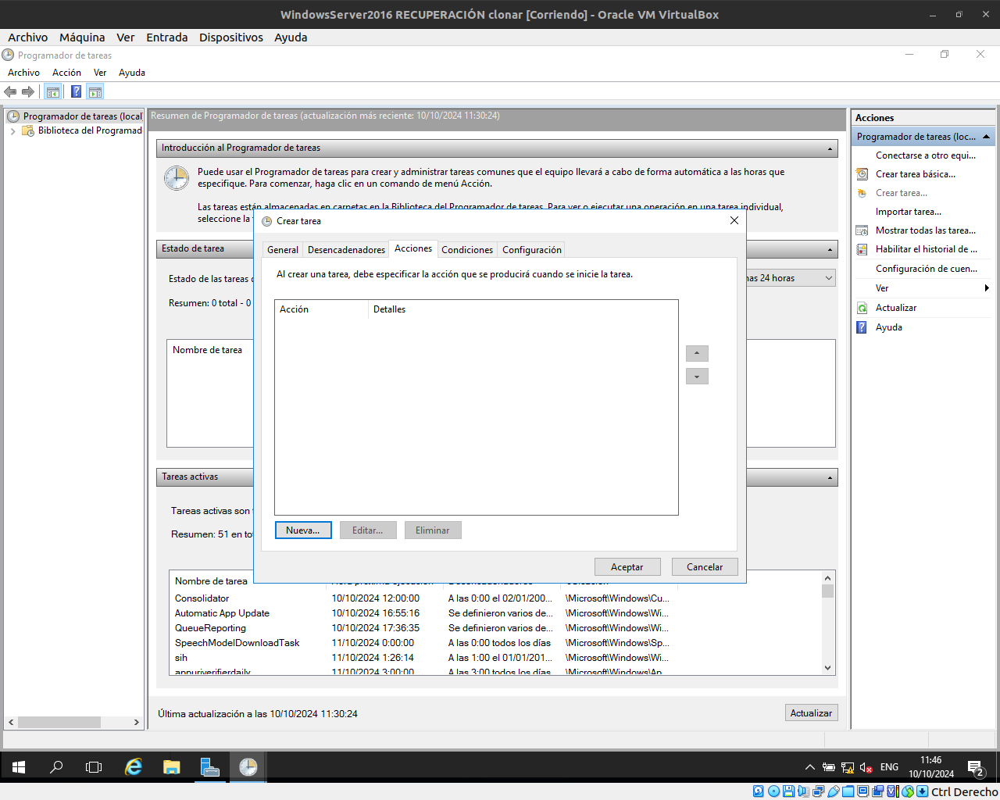
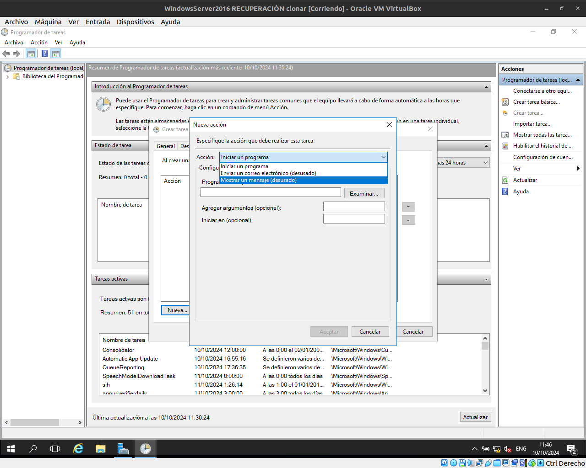
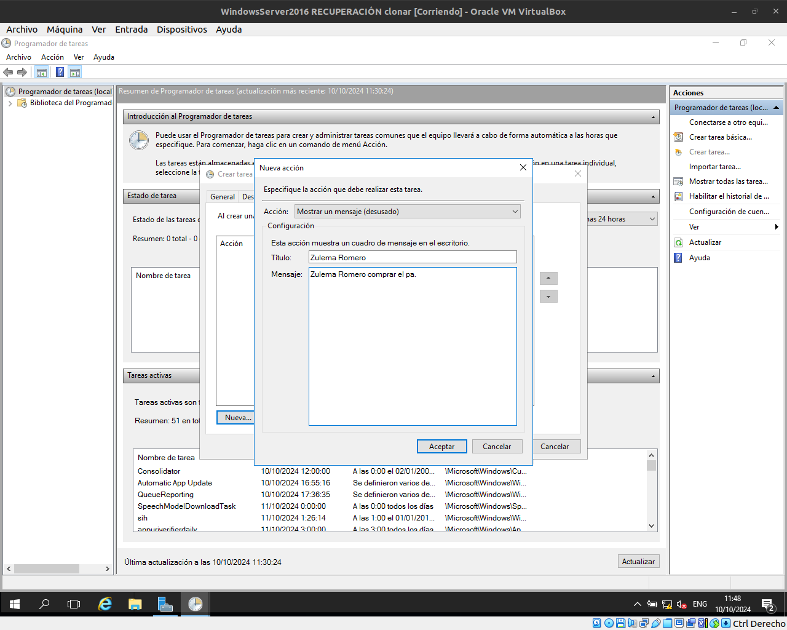
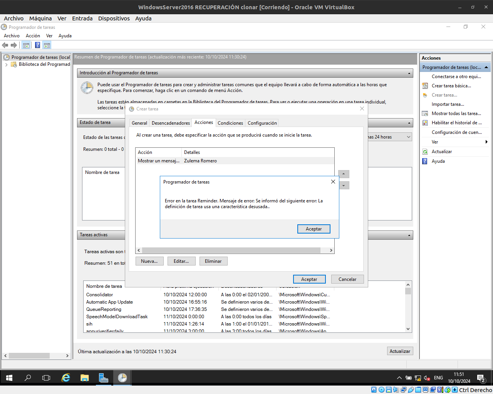
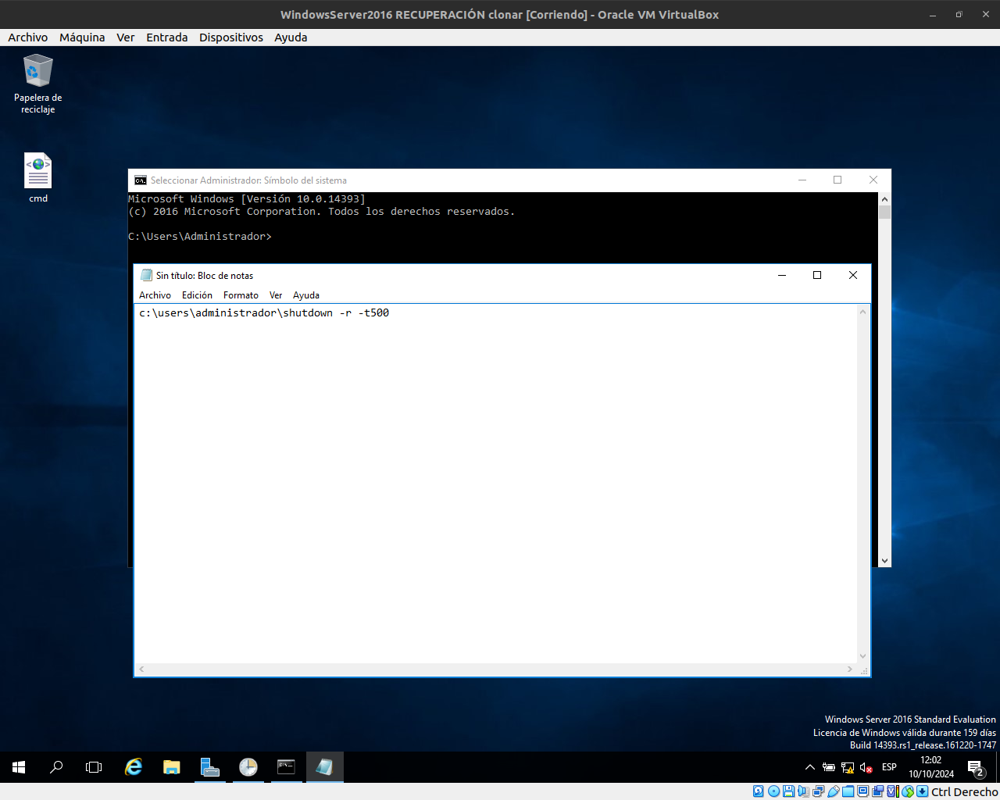
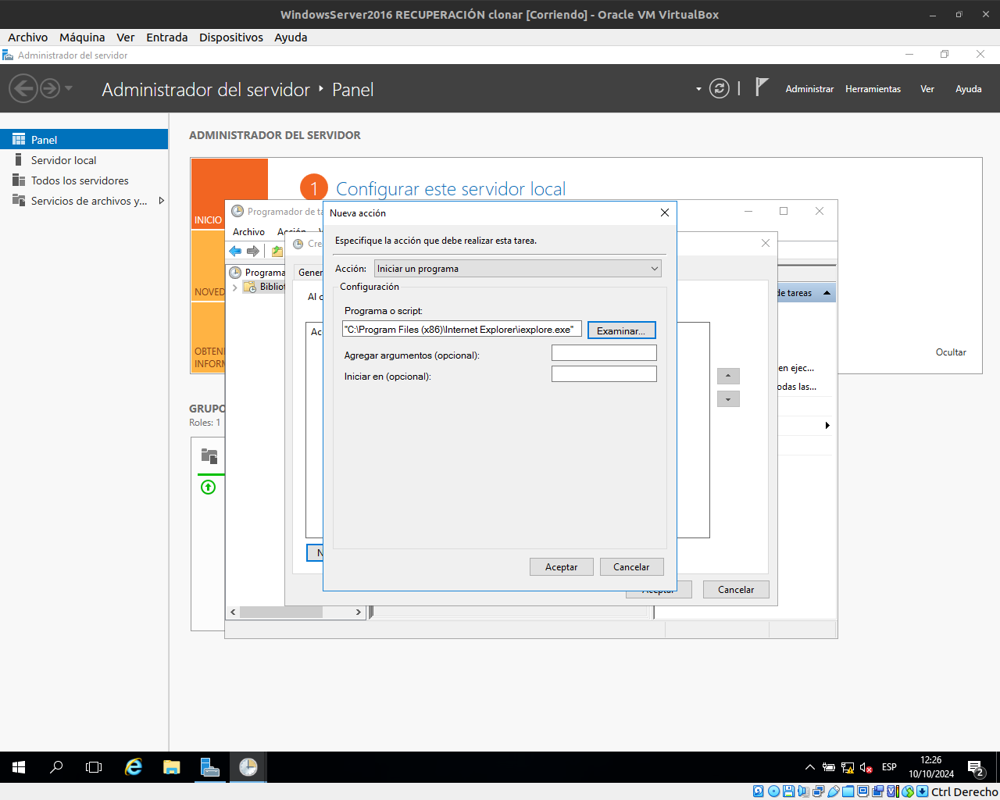
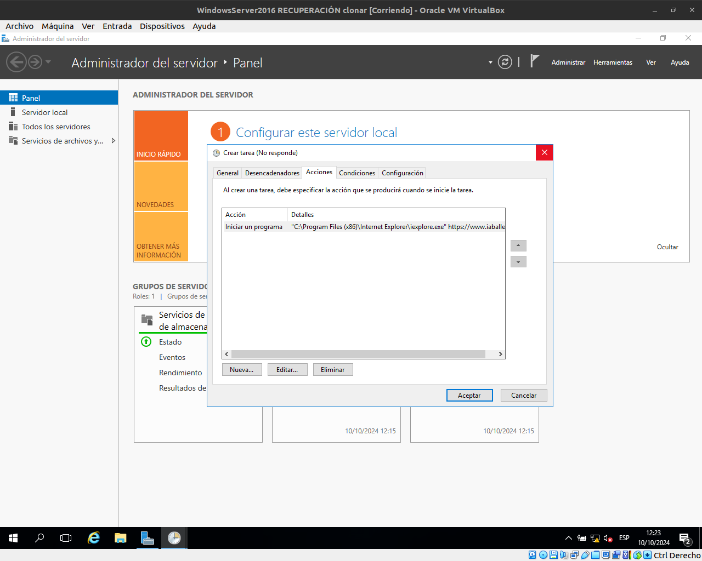

#  PROGRAMADOR DE TASQUES

# Activitat 1.
## Fes un recordatori que digui "X Y has de comprar el pa", on X Y sigui el teu nom i cognom.
## Fes que t'avisi en algun moment de la classe.

Primer obrirem el desplegable de Herraminetas de l'administrador de Windows server i clicarem a on fica "Programador de tareas".
A la dreta hi ha l'apartat "Acciones" i clicarem a "Crear tarea".
En ""General" i ficarem un nom i una petita descripció a la tasca. A la part de sota hi ha un apartat que fica "Configurar para.." 
Allá li direm per a Windows Server 2016.

En "Desencadenadores" clicarem a "Nuevo". Amb això podrem programar el recordatori mentres estem inciaiats. 

Li donem a "Aceptar"

Ara a l'apartat "Acciones" clicarem a "Nueva".

En accions escollirem "Mostrar un mensaje".

Ara li fiquem el missatge que volem que mostri i li donem a "Aceptar".

Ja surt configurat i li donem a "Aceptar" per finalitzar. 
Ens sortirà un missatge d'error. 

-------------------------------------------------------------------------------------------------------------------------------------
# Activitat 2.
## Programa el reinici de l'ordinador per a un moment de la classe.

Primer haurem de crear un Archiu al bloc de notes i ficar la seguent comanda: 
    c:\users\administrador\shutdown -r-t500
Això farà que el nostre ordinador es reinici després de 500 segons. 
Ara guardarem l'arxiu en .bat

Després anirem a la configuració de "Crear tarea" i en l'apartat de accions li donarem a "Nueva". 

Ara podrem escollir si volem iniciar un programa o script, li donarem a "Examinar" i seleccionarem el .bat que hem creat anteriorment. Li donem a "Aceptar".

A l'apartat "General" posarem un nom a la tasca i l'opció d'executar tant si l'usuari está iniciat com si no i en desencadenadores una hora d'execucció. 
Ara esperarem a que es faci el reinici del PC. 

-------------------------------------------------------------------------------------------------------------------------------------
# Activitat 3.
## Fes que quan un usuari iniciï sessió s'obri el navegador amb la web de l'institut.
## Comproba que funciona.

Anirem a la configuració de "Crear tarea" i en l'apartat de accions li donarem a "Nueva". 
A l'apartat "General" posarem un nom a la tasca i l'opció d'executar tant si l'usuari está iniciat com si no i en desencadenadores una hora d'execucció. 
Ara escollirem el programa que volem iniciar, en aquest cas el internet explorer

En l'apartat de "Agregar argumentos ficarem la URL de l'institut.
"
Li donem a "Aceptar" i ja ho tenim. 

-------------------------------------------------------------------------------------------------------------------------------------
# Activitat 4.
## Fes que una aplicació s'executi a una hora determinada.
## Comproba que funciona.

Anirem a la configuració de "Crear tarea" i en l'apartat de accions li donarem a "Nueva". 
A l'apartat "General" posarem un nom a la tasca i l'opció d'executar tant si l'usuari está iniciat com si no i en desencadenadores una hora d'execucció. 
Ara escollirem el programa que volem iniciar, en aquest cas el internet explorer.
"
Li donem a "Aceptar" i ja ho tenim. 

-------------------------------------------------------------------------------------------------------------------------------------
# Activitat 5. (No surt la brossa i no está documentat amb captures)
## Esborra fitxers i deixa'ls a la paperera de reciclatge.
## Programa que la paperera de reciclatge es buidi a una hora determinada.
## Comproba que funciona.

Anirem a la configuració de "Crear tarea" i en l'apartat de accions li donarem a "Nueva". 

A l'apartat "General" posarem un nom a la tasca i l'opció d'executar tant si l'usuari está iniciat com si no i en desencadenadores una hora d'execucció. 

Ara escollirem el programa que volem iniciar, en aquest cas la brossa.

a l'apartat de programa o script posarem la seguent comanda:
    PowerShell.exe.
    
I a l'apartat argumentos posarem la seguent comanda:
    NoProfile -Command "Clear-RecycleBin -Force".
    
Li donem a "Aceptar" i ja ho tenim. 
