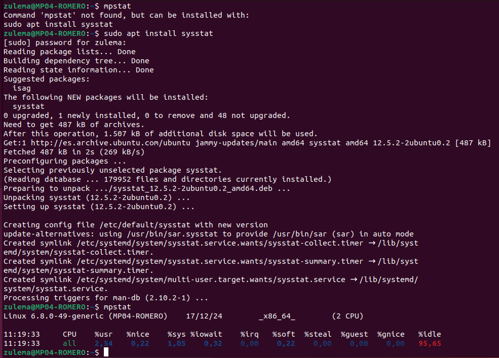
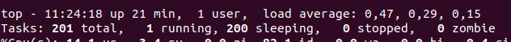
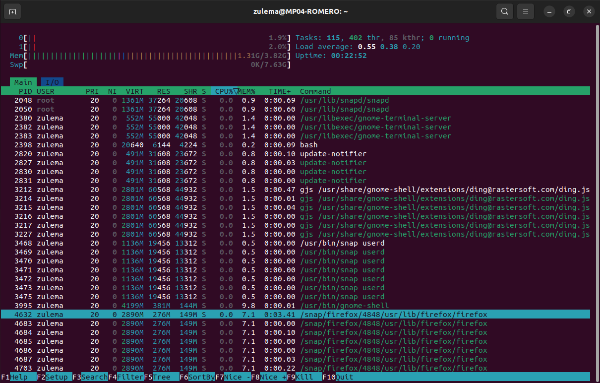
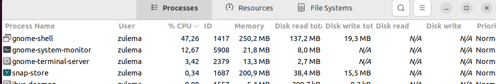
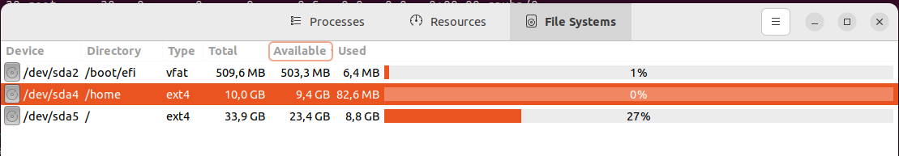
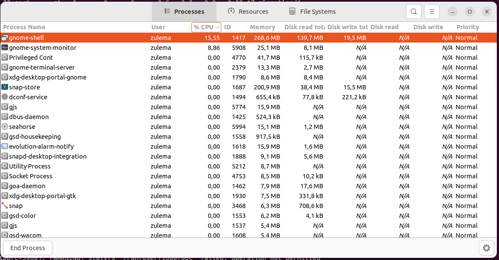
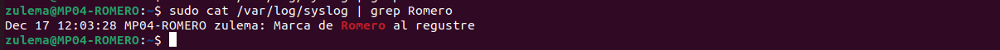

1. Utilitza la comanda free i busca quanta memòria lliure té el sistema, indica-
la.

1.4Gb

3. Obre Firefox i busca i indica la memòria lliure del sistema.

1.1GB
   
5. Amb la comanda mpstat indica quanta capacitat de CPU està lliure i
quantes CPUs té el sistema.

6. Obre Firefox i utilitza la comanda top i fes una captura, sobre la captura fes
el següent:
  •Indica si el sistema està més carregat ara que fa cinc minuts o menys
carregat, justifica per què? 
  •Busca el PID del procés Firefox. (4632)
  •Mata el procés firefox des de top. 
  •Indica quanta memòria d'intercanvi està utilitzant el sistema.  
  •Indica quants processos tens oberts i quants estan en execució en
aquest moment. 
  •Torna a obrir Firefox i mostra el procés amb la ruta a l'executable del
programa. 

7. Amb la comanda htop mostra el percentatge de la memòria utilitzada.

8. Utilitzant gnome-system-monitor mostra:
  •El procés que utilitza més memòria.
  •El procés que utilitza més CPU.
  •Obre el programa calculadora i busca'l.
  •Indica el seu PID.
  •Mata el procés.
  •Amb el monitor de recursos mostra l'activitat de xarxa.
  •Amb Sistema de fitxers mostra l'espai lliure a /home.
  •mostra l'espai lliure a l'arrel del sistema.
  •Canvia les preferències per que els processos s'actualitzin cada 2
segons i per que mostri l'estat d'execució dels processos.
  A la part de configuració redueixes el temps. 
  •Busca els processos que estan en estat d'execució i mostra'ls.

10. Monitoratge:
  •Crea la carpeta /prova!
  •Busca a /var/log/auth.log l'esdeveniment on es registra que has creat la
carpeta.
  •Elimina-la.
  •Busca l'esdeveniment on es registra que l'has eliminat.
  •Inicialitza gedit.
  •Busca a /var/log/syslog el registre d'obertura de gedit.!
  •Crea un registre que digui "Marca de X al registre" on X és el teu cognom.
  •Busca el registre i mostra'l.
  •Mostra els registres d'error de dmesg.
  •Mostra de forma gràfica els registres d'aplicacions del sistema.
  •Obre una aplicació i mostra el registre a l'aplicació gràfica.
