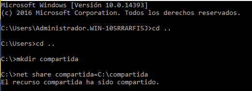
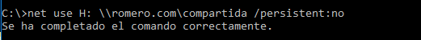
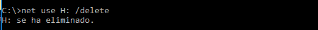
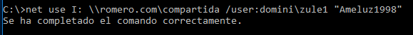
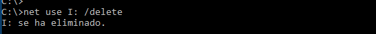
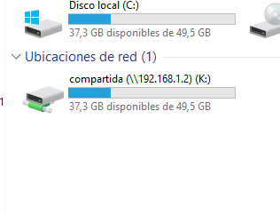
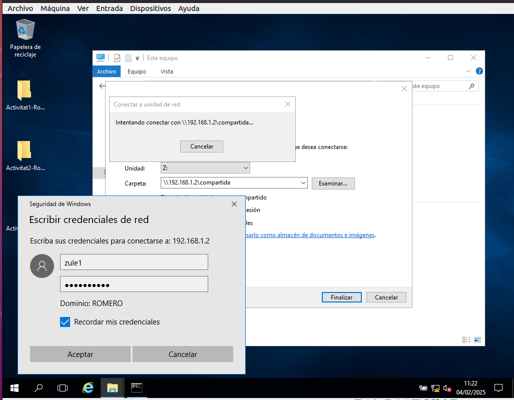
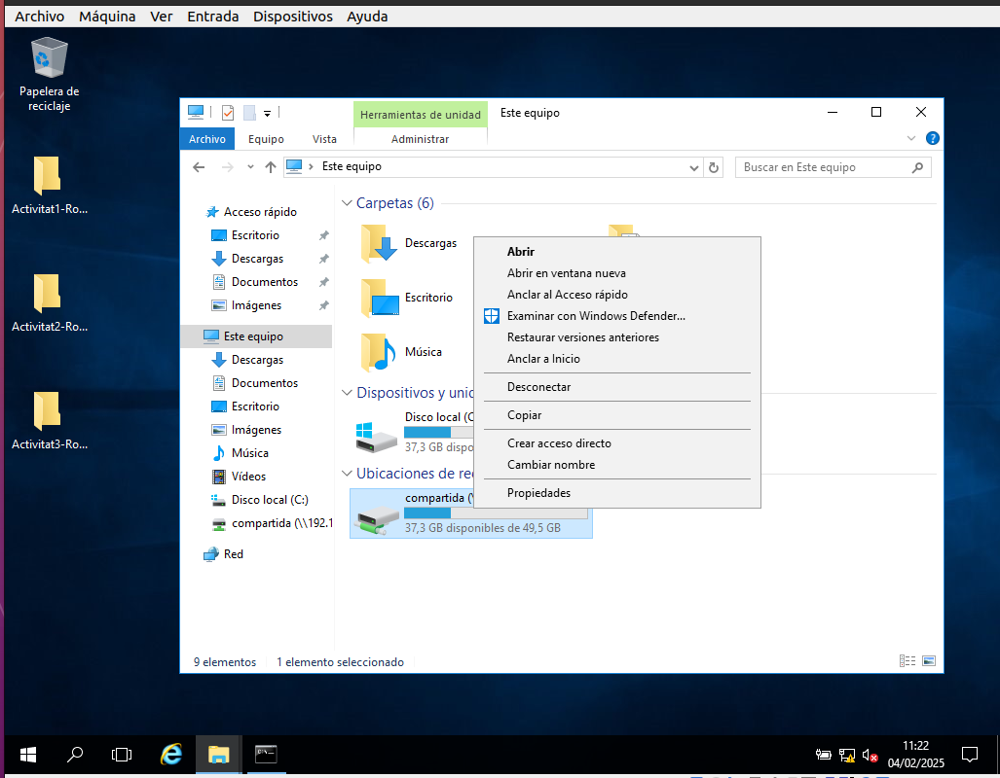

# 1 Utilitzant NET USE.
  -Crea un recurs compartit amb els usuaris de domini. Una carpeta anomenada compartida dins de C: del servidor.
    
    
  -Des del client utilitza net use per connectar la lletra H: que no sigui persistent.
    
    
  -Desconnecta la unitat.
    

    
  -Connecta el recurs a la lletra I: amb credencials d'un usuari.
    
    
  -Desconnecta la unitat.
    
    
   
# 2 Utilitzant interfície gràfica.
  -Fes el mateix que a l'exercici 1.
    
    
    
  
