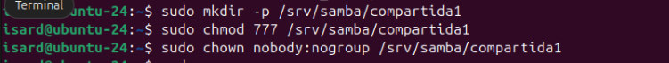
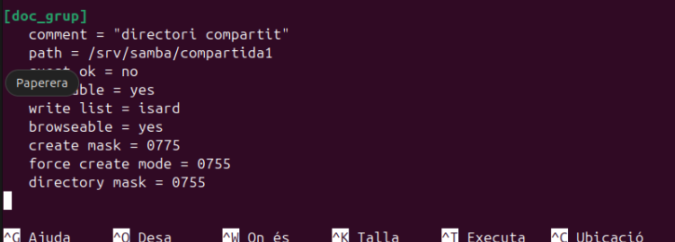
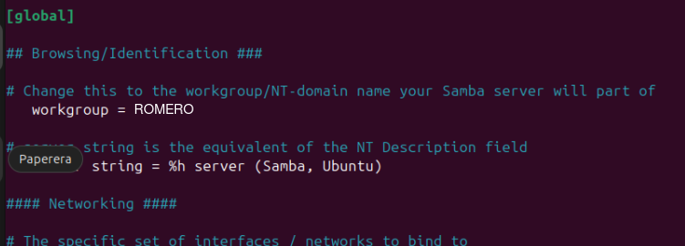
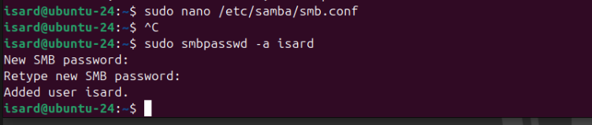
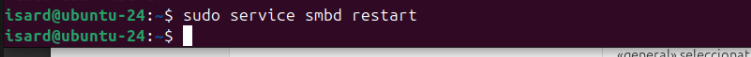
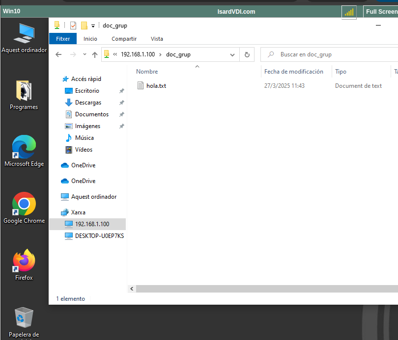
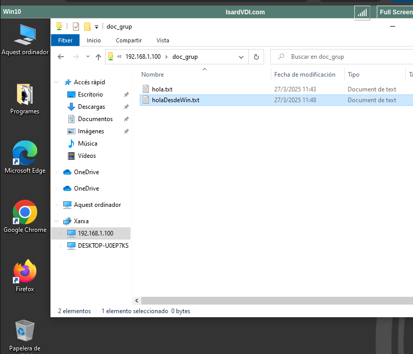
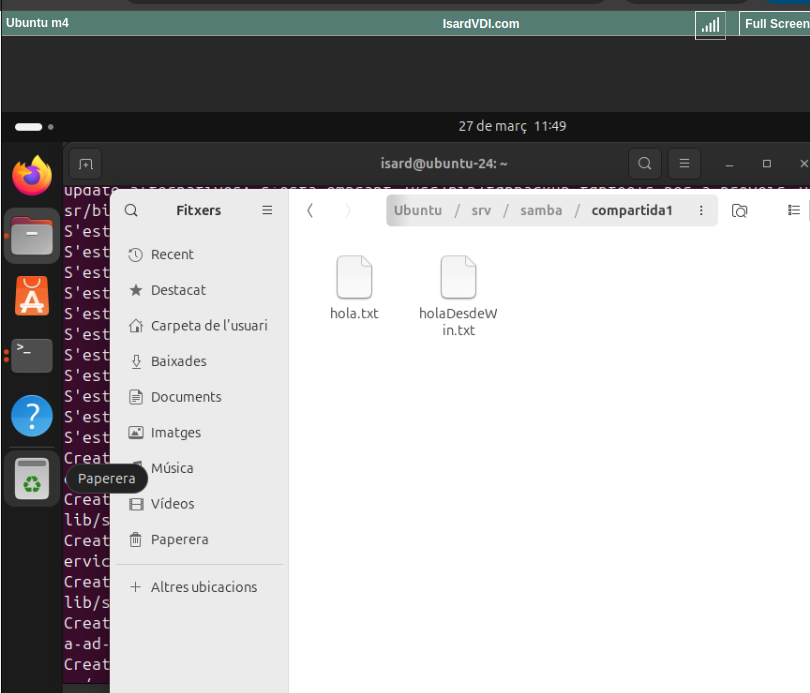
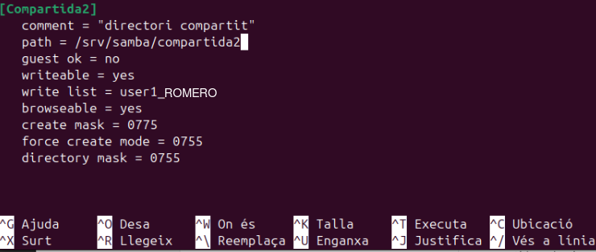

# Activitat 1

## Crea una carpeta a la MV Linux a /srv/samba/compartida1 amb els permisos necessaris perquè pugui accedir tothom.

## Crea la configuració de SAMBA per compartir la carpeta per a convidats (sense autenticació) amb lectura i escriptura.

## Reinicia el servei SAMBA.

## Comprova que tens accés des de Windows.

## Crea algun fitxer a la carpeta.

## Comprova que s'ha creat a Linux.

# Activitat 2

## Crea una carpeta a la MV Linux a /srv/samba/compartida2 amb els permisos necessaris.

## Crea un usuari local anomenat user1_X (on X és el teu cognom).

## Afegeux l'usuari anterior a SAMBA.

## Crea la configuració de SAMBA per compartir la carpeta per a l'usuari anterior amb lectura i escriptura amb màscara de fitxers 755.

## Reinicia el servei SAMBA.

## Comprova que tens accés des de Windows amb les credencials de l'usuari.

## Crea algun fitxer a la carpeta.ç

## Comprova que s'ha creat a Linux i té els permisos 755.
